# SmartDeliveryApp - Technical Architecture

## 📋 Table of Contents
- [System Overview](#system-overview)
- [Detailed Architecture](#detailed-architecture)
- [Data Flow Diagrams](#data-flow-diagrams)
- [Service Communication](#service-communication)
- [Database Architecture](#database-architecture)
- [Security Architecture](#security-architecture)
- [Deployment Architecture](#deployment-architecture)

## 🏗️ System Overview

SmartDeliveryApp is a microservices-based food delivery platform that follows Domain-Driven Design (DDD) and Clean Architecture principles. The system is designed for scalability, maintainability, and high availability.

### Core Principles
- **Separation of Concerns**: Each service has a single responsibility
- **Loose Coupling**: Services communicate through well-defined APIs
- **High Cohesion**: Related functionality is grouped together
- **Eventual Consistency**: Services can operate independently
- **Fault Tolerance**: Services are resilient to failures

## 🏛️ Detailed Architecture

### Service Layer Architecture

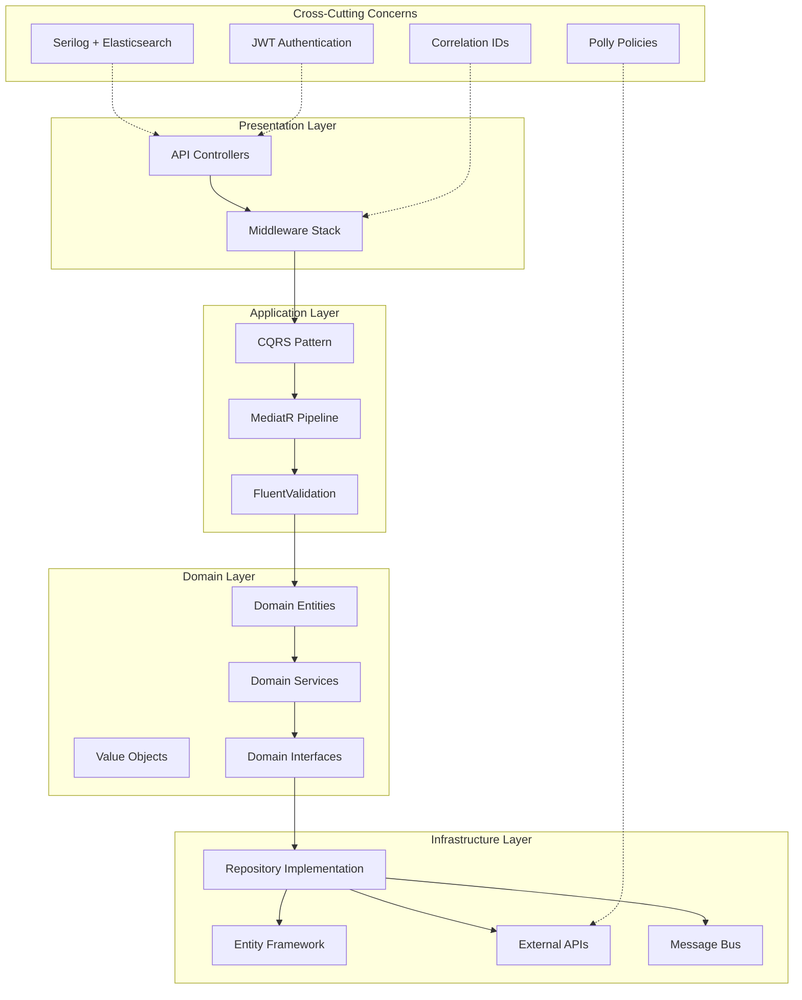

### Order Service Internal Structure

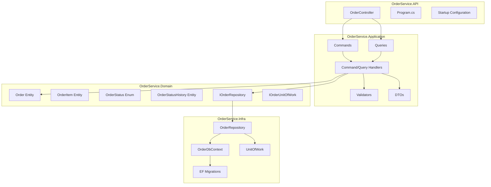

### Restaurant Service Internal Structure

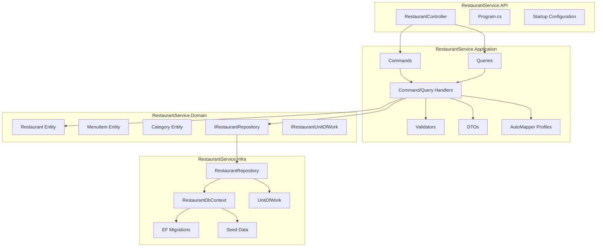

### Payment Service Internal Structure

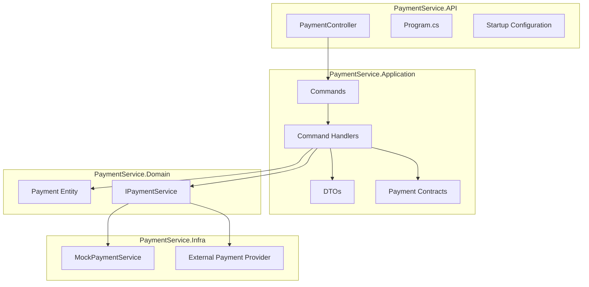

## 🔄 Data Flow Diagrams

### Order Creation Flow

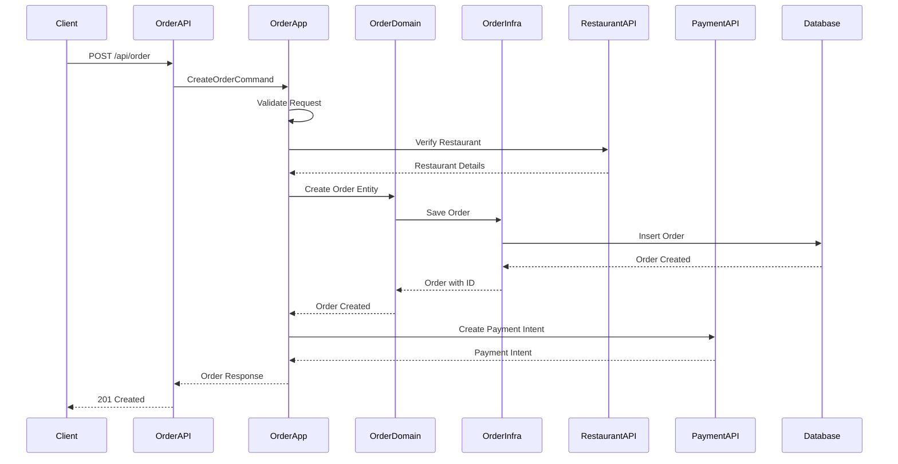

### Restaurant Management Flow

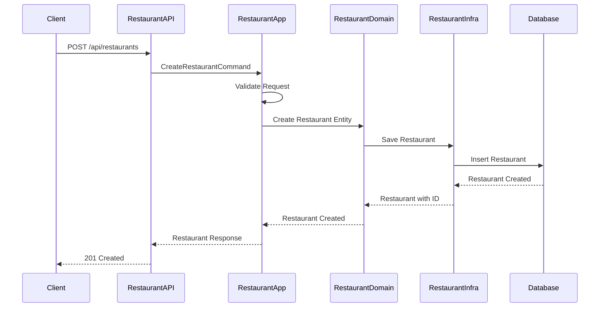

### Payment Processing Flow

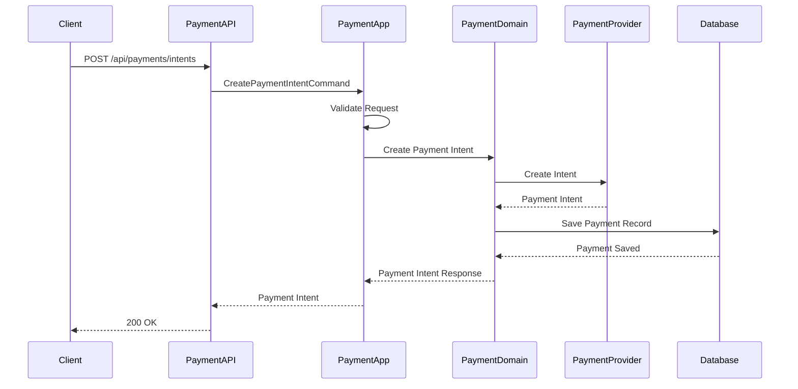

## 🌐 Service Communication

### Inter-Service Communication Patterns

```mermaid
graph TB
    subgraph "Synchronous Communication"
        HTTP[HTTP/REST APIs]
        gRPC[gRPC (Future)]
    end
    
    subgraph "Asynchronous Communication"
        MessageQueue[Message Queue (Future)]
        EventBus[Event Bus (Future)]
    end
    
    subgraph "Service Discovery"
        ServiceRegistry[Service Registry]
        LoadBalancer[Load Balancer]
    end
    
    subgraph "Resilience Patterns"
        CircuitBreaker[Circuit Breaker]
        RetryPolicy[Retry Policy]
        Timeout[Timeout Policy]
    end
    
    HTTP --> CircuitBreaker
    gRPC --> CircuitBreaker
    CircuitBreaker --> RetryPolicy
    RetryPolicy --> Timeout
    Timeout --> ServiceRegistry
    ServiceRegistry --> LoadBalancer
```

### Current Service Dependencies

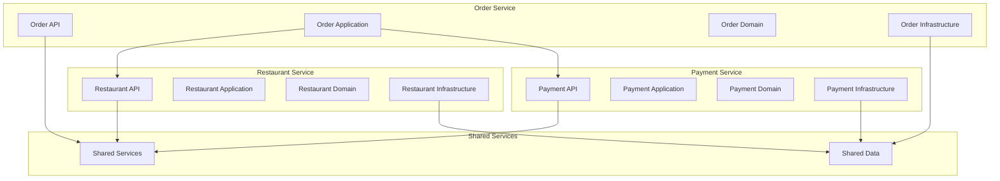

## 🗄️ Database Architecture

### Database Per Service Pattern

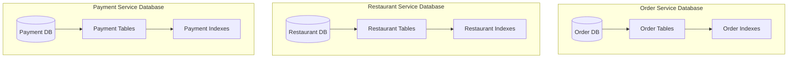

### Database Schema Relationships

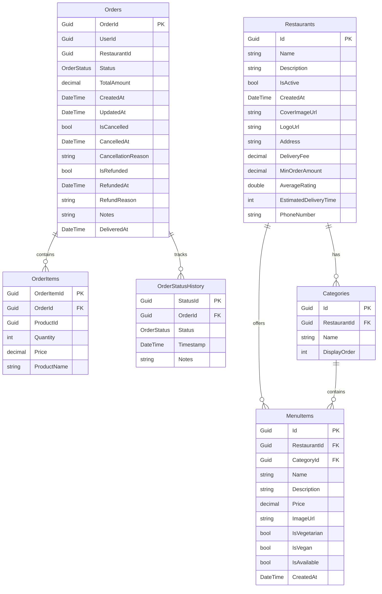

## 🔒 Security Architecture

### Authentication and Authorization Flow

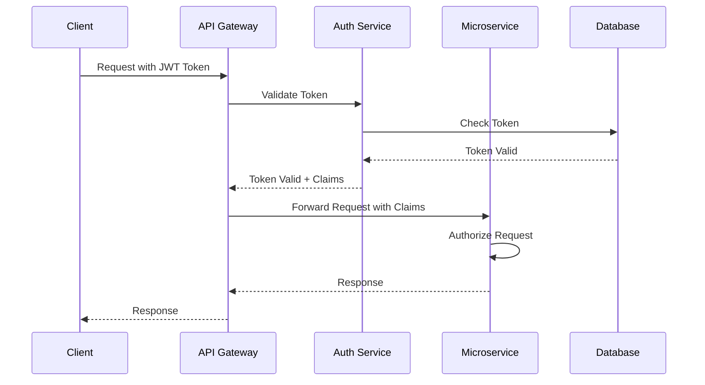

### Security Layers

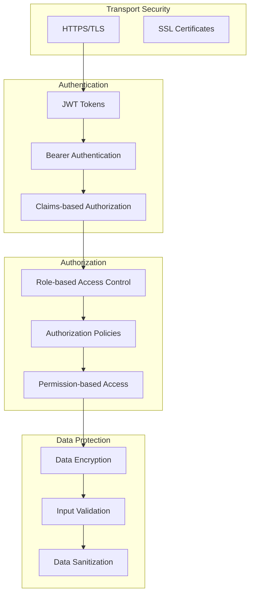

## 🚀 Deployment Architecture

### Container Deployment

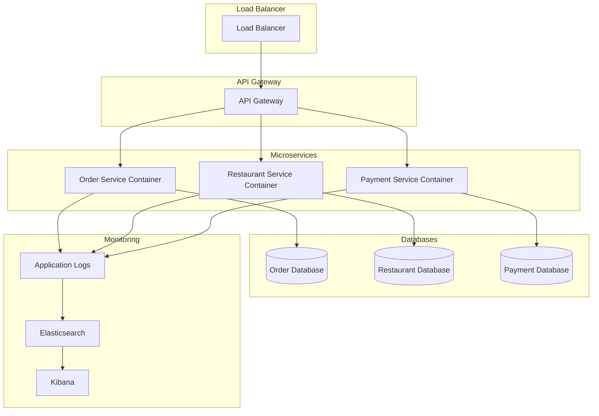

### Development Environment

```mermaid
graph TB
    subgraph "Development Tools"
        VS[Visual Studio]
        VS Code[VS Code]
        Docker[Docker Desktop]
    end
    
    subgraph "Local Services"
        SQL Server[SQL Server LocalDB]
        Elasticsearch[Elasticsearch Container]
        Kibana[Kibana Container]
    end
    
    subgraph "Application Services"
        OrderService[Order Service]
        RestaurantService[Restaurant Service]
        PaymentService[Payment Service]
    end
    
    VS --> OrderService
    VS Code --> RestaurantService
    VS Code --> PaymentService
    OrderService --> SQL Server
    RestaurantService --> SQL Server
    PaymentService --> SQL Server
    OrderService --> Elasticsearch
    RestaurantService --> Elasticsearch
    PaymentService --> Elasticsearch
    Elasticsearch --> Kibana
    Docker --> Elasticsearch
    Docker --> Kibana
```

## 📊 Monitoring and Observability

### Logging Architecture

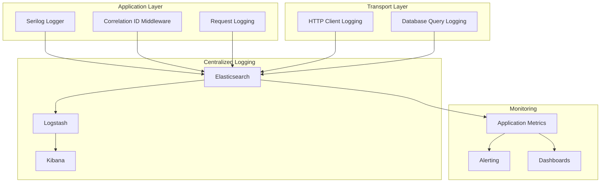

### Health Checks and Monitoring

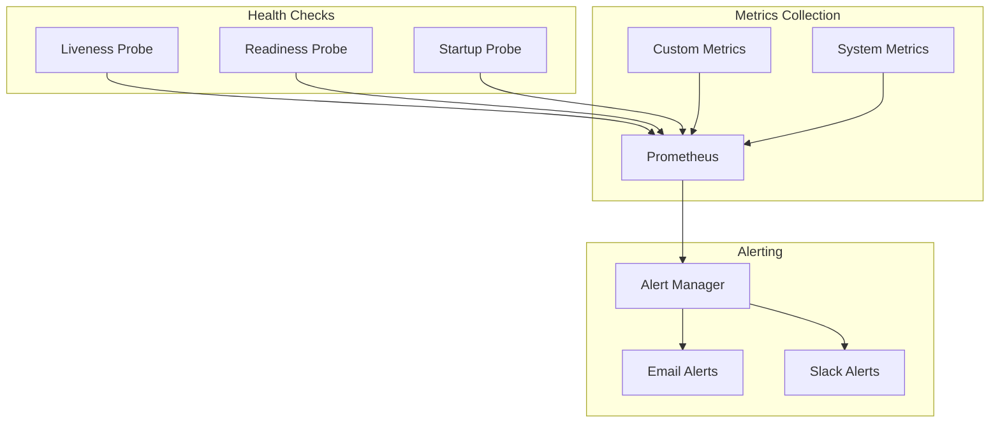

## 🔄 CQRS Implementation

### Command and Query Separation

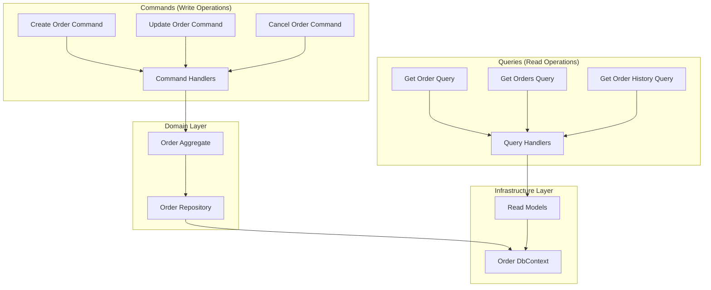

## 🧪 Testing Strategy

### Testing Pyramid

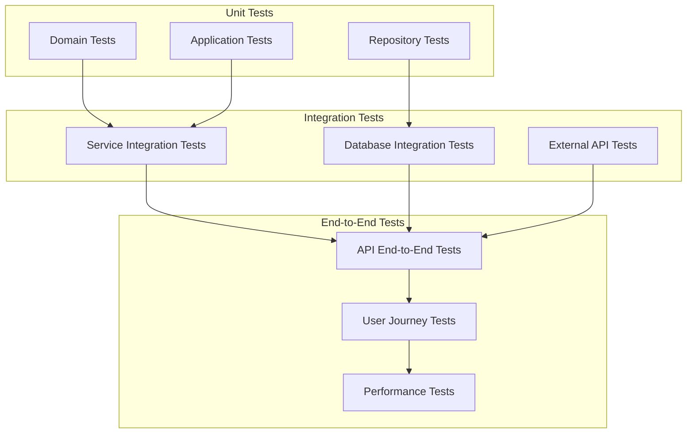

This technical architecture document provides a comprehensive view of the SmartDeliveryApp's internal structure, data flows, and implementation details. The diagrams help visualize the complex relationships between different components and services. 