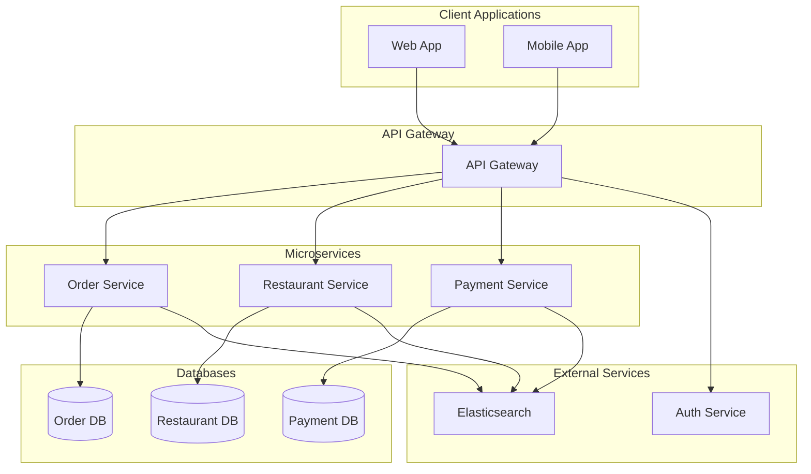
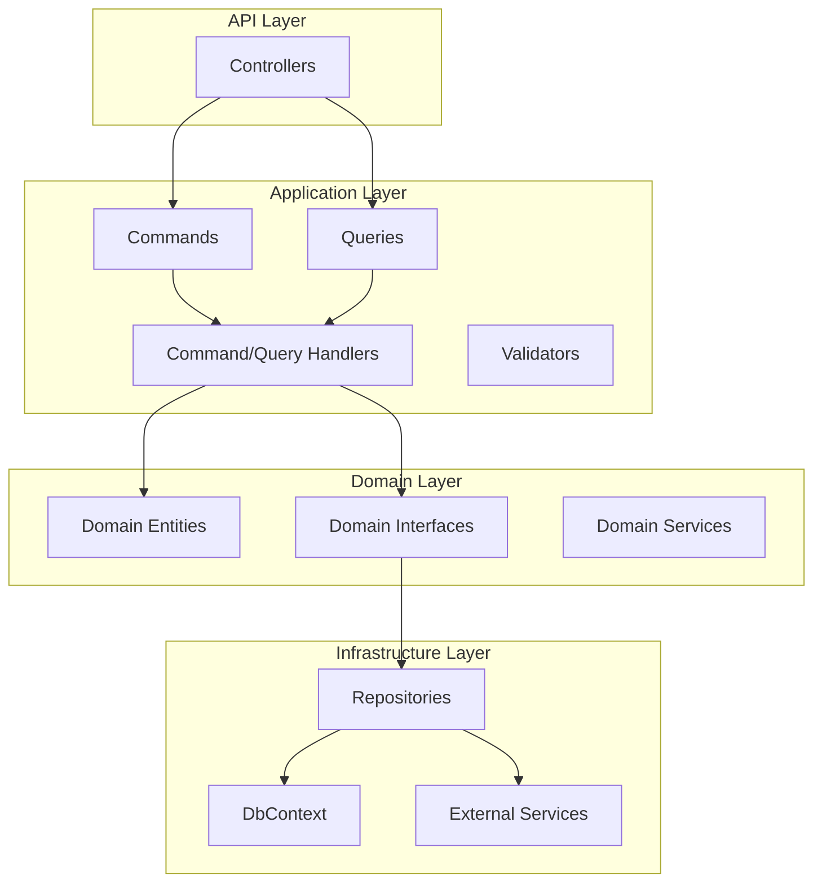
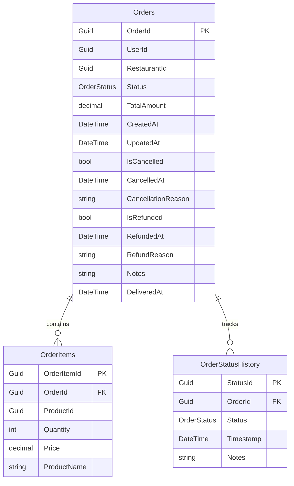
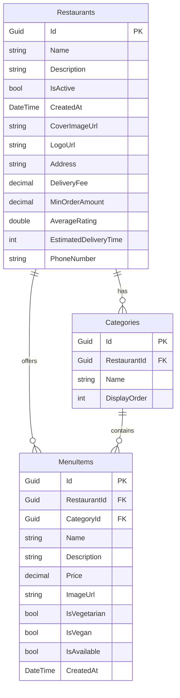

# SmartDeliveryApp - Microservices Architecture

## 📋 Table of Contents
- [Overview](#overview)
- [Architecture](#architecture)
- [Services](#services)
- [Features](#features)
- [Technology Stack](#technology-stack)
- [Database Design](#database-design)
- [API Endpoints](#api-endpoints)
- [Deployment](#deployment)
- [Development Setup](#development-setup)

## 🏗️ Overview

SmartDeliveryApp is a microservices-based food delivery platform built with .NET 8, following Clean Architecture principles and CQRS pattern. The application consists of three main services: Order Service, Restaurant Service, and Payment Service.

## 🏛️ Architecture

### High-Level Architecture Diagram



### Service Architecture (Clean Architecture)



## 🚀 Services

### 1. Order Service
**Purpose**: Manages order lifecycle, tracking, and status updates

**Key Features**:
- Create new orders
- Track order status
- Update order information
- Order history management
- Integration with restaurant and payment services

**Domain Entities**:
- `Order`: Main order entity with status tracking
- `OrderItem`: Individual items in an order
- `OrderStatusHistory`: Audit trail of status changes
- `OrderStatus`: Enum for order states

### 2. Restaurant Service
**Purpose**: Manages restaurant information, menus, and categories

**Key Features**:
- Restaurant registration and management
- Menu item management
- Category organization
- Restaurant search and filtering
- Rating and review system

**Domain Entities**:
- `Restaurant`: Restaurant information and settings
- `MenuItem`: Individual menu items
- `Category`: Menu categories for organization

### 3. Payment Service
**Purpose**: Handles payment processing and transaction management

**Key Features**:
- Payment intent creation
- Payment confirmation
- Transaction tracking
- Integration with payment providers

**Domain Entities**:
- `Payment`: Payment transaction records

## 🎯 Features

### Core Features

#### Order Management
- ✅ Create orders with multiple items
- ✅ Track order status (Pending, Confirmed, Preparing, Ready, Delivered)
- ✅ Order history and audit trail
- ✅ Order cancellation and refunds
- ✅ Real-time status updates

#### Restaurant Management
- ✅ Restaurant registration and profile management
- ✅ Menu item creation and management
- ✅ Category-based menu organization
- ✅ Restaurant search and filtering
- ✅ Rating and review system
- ✅ Delivery fee and minimum order configuration

#### Payment Processing
- ✅ Payment intent creation
- ✅ Payment confirmation
- ✅ Transaction tracking
- ✅ Mock payment service for development

### Technical Features

#### Cross-Cutting Concerns
- ✅ Structured logging with Serilog and Elasticsearch
- ✅ Correlation ID tracking across services
- ✅ JWT authentication
- ✅ Swagger API documentation
- ✅ Exception handling middleware
- ✅ HTTP client policies with Polly
- ✅ Docker containerization

#### Architecture Patterns
- ✅ Clean Architecture (Domain, Application, Infrastructure layers)
- ✅ CQRS (Command Query Responsibility Segregation)
- ✅ MediatR for command/query handling
- ✅ Repository pattern
- ✅ Unit of Work pattern
- ✅ Domain-driven design

## 🛠️ Technology Stack

### Backend
- **Framework**: .NET 8
- **Architecture**: Clean Architecture + CQRS
- **ORM**: Entity Framework Core 9.0
- **Database**: SQL Server
- **Messaging**: MediatR
- **Validation**: FluentValidation
- **Logging**: Serilog + Elasticsearch
- **Authentication**: JWT Bearer Tokens
- **Documentation**: Swagger/OpenAPI

### Infrastructure
- **Containerization**: Docker
- **Resilience**: Polly (Circuit Breaker, Retry policies)
- **Monitoring**: Elasticsearch for log aggregation
- **Testing**: xUnit for unit tests

### Shared Libraries
- **SharedSvc**: Common utilities, middleware, and extensions
- **Shared.Data**: Base repository and unit of work patterns

## 🗄️ Database Design

### Order Service Database Schema



### Restaurant Service Database Schema



## 📡 API Endpoints

### Order Service API

| Method | Endpoint | Description |
|--------|----------|-------------|
| POST | `/api/order` | Create a new order |
| GET | `/api/order/{id}` | Get order by ID |
| PUT | `/api/order/{orderId}/status` | Update order status |
| GET | `/api/order/logging-test` | Test logging functionality |

### Restaurant Service API

| Method | Endpoint | Description |
|--------|----------|-------------|
| POST | `/api/restaurants` | Create a new restaurant |
| GET | `/api/restaurants/{id}` | Get restaurant by ID |
| GET | `/api/restaurants` | Get all restaurants |
| GET | `/api/restaurants/{id}/details` | Get restaurant with full details |

### Payment Service API

| Method | Endpoint | Description |
|--------|----------|-------------|
| POST | `/api/payments/intents` | Create payment intent |
| POST | `/api/payments/confirm` | Confirm payment |

## 🚀 Deployment

### Docker Configuration

The application includes Docker support with separate Dockerfiles for each service:

```dockerfile
# Order Service Dockerfile
FROM mcr.microsoft.com/dotnet/aspnet:8.0 AS runtime
WORKDIR /app
COPY ./publish/OrderService/ .
ENTRYPOINT ["dotnet", "OrderService.API.dll"]
```

### Environment Configuration

Each service supports configuration through:
- `appsettings.json` - Base configuration
- `appsettings.Development.json` - Development-specific settings
- Environment variables - Production configuration

### Key Configuration Sections

```json
{
  "ConnectionStrings": {
    "DefaultConnection": "Server=...;Database=...;"
  },
  "Elasticsearch": {
    "Uri": "http://elasticsearch:9200"
  },
  "JwtSettings": {
    "SecretKey": "...",
    "Issuer": "...",
    "Audience": "..."
  }
}
```

## 🛠️ Development Setup

### Prerequisites
- .NET 8 SDK
- SQL Server (or SQL Server Express)
- Docker (optional)
- Elasticsearch (optional, for logging)

### Getting Started

1. **Clone the repository**
   ```bash
   git clone <repository-url>
   cd SmartDeliveryApp
   ```

2. **Restore dependencies**
   ```bash
   dotnet restore
   ```

3. **Update connection strings**
   - Edit `appsettings.Development.json` in each service
   - Update database connection strings

4. **Run database migrations**
   ```bash
   # Order Service
   cd src/services/OrderService/OrderService.API
   dotnet ef database update
   
   # Restaurant Service
   cd src/services/RestaurantService/Restaurant.API
   dotnet ef database update
   ```

5. **Run the services**
   ```bash
   # Order Service
   cd src/services/OrderService/OrderService.API
   dotnet run
   
   # Restaurant Service
   cd src/services/RestaurantService/Restaurant.API
   dotnet run
   
   # Payment Service
   cd src/services/PaymentService/PaymentService.API
   dotnet run
   ```

### Running with Docker

```bash
# Build and run all services
docker-compose up --build
```

### Testing

```bash
# Run unit tests
dotnet test OrderService.Infra.Test
```

## 📊 Monitoring and Logging

### Logging Strategy
- **Structured Logging**: Using Serilog with JSON formatting
- **Centralized Logging**: All services log to Elasticsearch
- **Correlation IDs**: Track requests across services
- **Log Levels**: Information, Warning, Error with appropriate context

### Key Metrics
- Order creation and processing times
- Payment success/failure rates
- Restaurant service response times
- Error rates and types

## 🔒 Security

### Authentication
- JWT Bearer token authentication
- Token validation middleware
- Secure token generation and validation

### Data Protection
- Input validation using FluentValidation
- SQL injection prevention through EF Core
- HTTPS enforcement in production

## 🚧 Future Enhancements

### Planned Features
- [ ] User management service
- [ ] Notification service (SMS/Email)
- [ ] Delivery tracking service
- [ ] Analytics and reporting
- [ ] Real-time order updates (SignalR)
- [ ] Multi-language support
- [ ] Advanced search and filtering
- [ ] Recommendation engine

### Technical Improvements
- [ ] Event sourcing for order history
- [ ] Saga pattern for distributed transactions
- [ ] API Gateway implementation
- [ ] Service mesh integration
- [ ] Advanced caching strategies
- [ ] Performance monitoring and alerting

## 📝 Contributing

1. Follow Clean Architecture principles
2. Use CQRS pattern for new features
3. Add unit tests for new functionality
4. Update documentation for API changes
5. Follow the existing naming conventions

## 📄 License

This project is licensed under the MIT License - see the LICENSE file for details. 