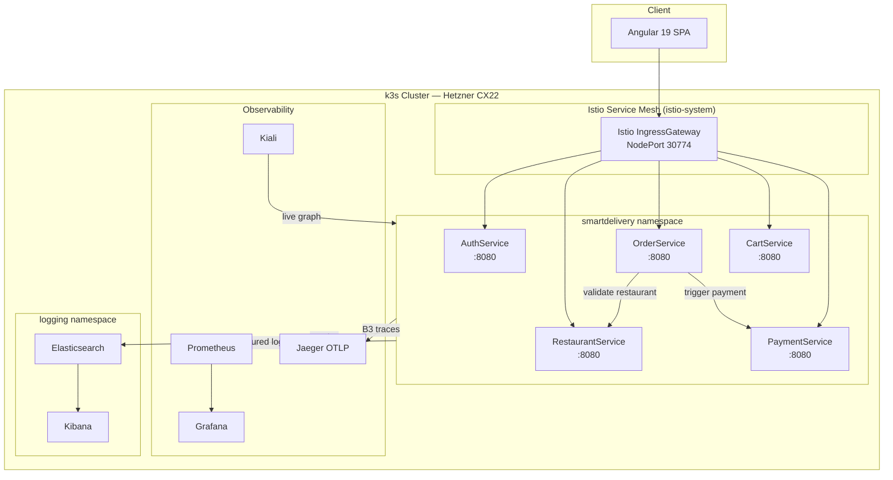
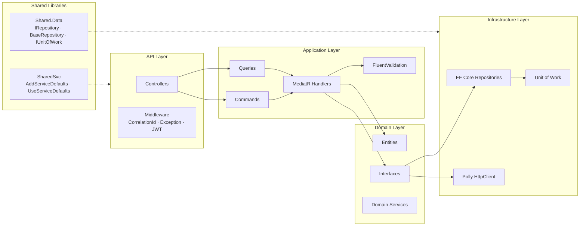
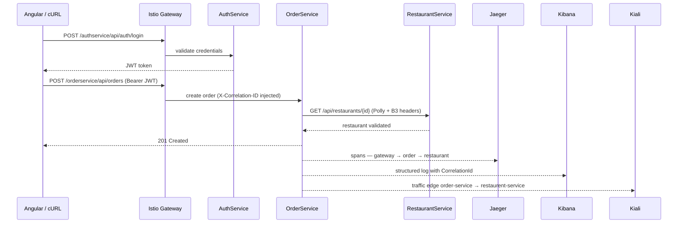
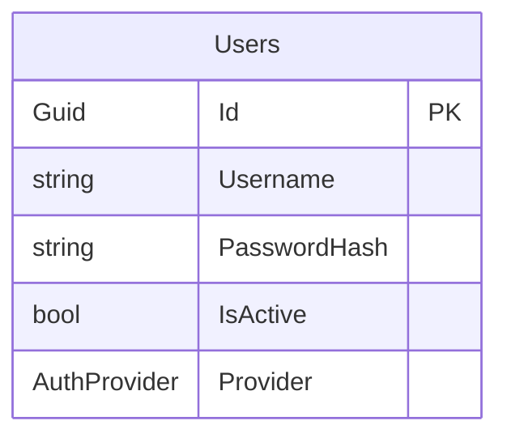
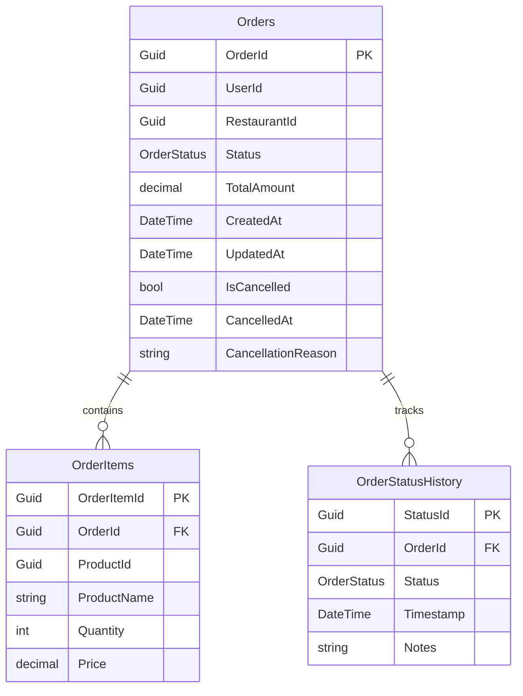
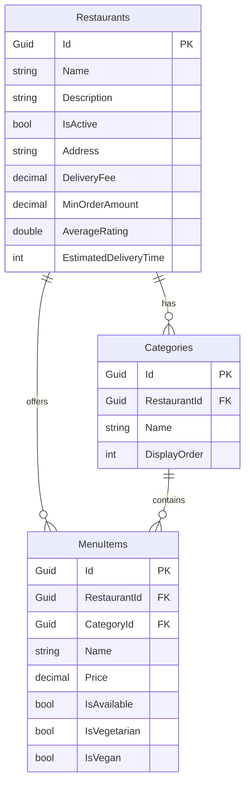
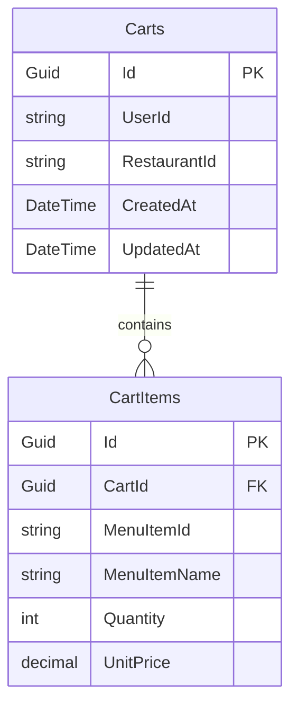
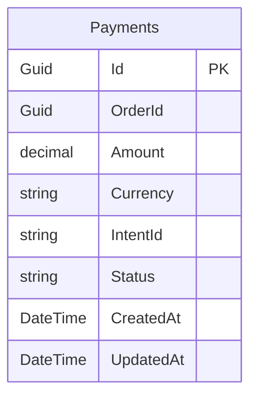
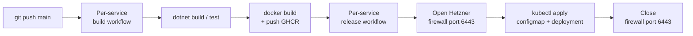

# SmartDelivery — Microservices Platform

> **.NET 10** · **Clean Architecture + CQRS** · **k3s / Istio** · **Angular 19** · **Last updated: 2025-08**

## 📋 Table of Contents
- [Overview](#overview)
- [Architecture](#architecture)
- [Services](#services)
- [Features](#features)
- [Technology Stack](#technology-stack)
- [Database Design](#database-design)
- [API Endpoints](#api-endpoints)
- [Deployment](#deployment)
- [Development Setup](#development-setup)

## 🏗️ Overview

SmartDelivery is a production-grade food delivery platform built with **.NET 10**, following Clean Architecture and CQRS patterns. It consists of **5 independent microservices** running on a k3s Kubernetes cluster with full Istio service mesh, distributed tracing, and centralized observability.

The platform demonstrates a real end-to-end delivery flow: user auth → browse restaurants → add to cart → place order → process payment — all visible across Jaeger traces, Kibana logs, and Kiali's live service graph simultaneously.

## 🏛️ Architecture

### High-Level Architecture

```
Cloudflare → Istio IngressGateway → 5 .NET 10 microservices (Istio sidecar mesh)
                                             ↓
                              Prometheus · Grafana · Jaeger · Kiali
                                             ↓
                              Elasticsearch · Kibana  (logging namespace)
```


```mermaid
flowchart TB
    subgraph Client["Client"]
        UI[Angular 19 SPA]
    end

    subgraph Cluster["k3s Cluster — Hetzner CX22"]
        subgraph Mesh["Istio Service Mesh (istio-system)"]
            GW[Istio IngressGateway\nNodePort 30774]
        end

        subgraph Services["smartdelivery namespace"]
            Auth[AuthService\n:8080]
            Restaurant[RestaurantService\n:8080]
            Order[OrderService\n:8080]
            Cart[CartService\n:8080]
            Payment[PaymentService\n:8080]
        end

        subgraph Observe["Observability"]
            Prometheus[Prometheus]
            Grafana[Grafana]
            Jaeger[Jaeger OTLP]
            Kiali[Kiali]
        end

        subgraph Logging["logging namespace"]
            ES[Elasticsearch]
            Kibana[Kibana]
        end
    end

    UI --> GW
    GW --> Auth
    GW --> Restaurant
    GW --> Order
    GW --> Cart
    GW --> Payment
    Order -->|validate restaurant| Restaurant
    Order -->|trigger payment| Payment
    Services -->|structured logs| ES
    ES --> Kibana
    Services -->|metrics| Prometheus
    Prometheus --> Grafana
    Services -->|B3 traces| Jaeger
    Kiali -->|live graph| Services
```

### Service Architecture — Clean Architecture (per service)


```mermaid
flowchart LR
    subgraph API["API Layer"]
        C[Controllers]
        MW[Middleware\nCorrelationId · Exception · JWT]
    end

    subgraph App["Application Layer"]
        CMD[Commands]
        QRY[Queries]
        H[MediatR Handlers]
        V[FluentValidation]
    end

    subgraph Domain["Domain Layer"]
        E[Entities]
        I[Interfaces]
        DS[Domain Services]
    end

    subgraph Infra["Infrastructure Layer"]
        R[EF Core Repositories]
        UOW[Unit of Work]
        HTTP[Polly HttpClient]
    end

    subgraph Shared["Shared Libraries"]
        SSvc[SharedSvc\nAddServiceDefaults · UseServiceDefaults]
        SData[Shared.Data\nIRepository · BaseRepository · IUnitOfWork]
    end

    C --> CMD & QRY
    CMD & QRY --> H
    H --> V
    H --> E & I
    I --> R & HTTP
    R --> UOW
    SSvc -.-> API
    SData -.-> Infra
```

### Showcase Flow — One Request, Full Observability Triad


```mermaid
sequenceDiagram
    participant UI as Angular / cURL
    participant GW as Istio Gateway
    participant Auth as AuthService
    participant Order as OrderService
    participant Rest as RestaurantService
    participant J as Jaeger
    participant K as Kibana
    participant Ki as Kiali

    UI->>GW: POST /authservice/api/auth/login
    GW->>Auth: validate credentials
    Auth-->>UI: JWT token

    UI->>GW: POST /orderservice/api/orders (Bearer JWT)
    GW->>Order: create order (X-Correlation-ID injected)
    Order->>Rest: GET /api/restaurants/{id} (Polly + B3 headers)
    Rest-->>Order: restaurant validated
    Order-->>UI: 201 Created

    Order-->>J: spans — gateway → order → restaurant
    Order-->>K: structured log with CorrelationId
    Order-->>Ki: traffic edge order-service → restaurent-service
```

## 🚀 Services

### 1. AuthService
**Purpose**: JWT issuer and user identity store

**Key Features**:
- User login and registration
- HS256 JWT (8h expiry) consumed by all services
- EF Core + SQL Server user store with seed data (`admin` / `password123`)

**Domain Entities**:
- `User`: username, password hash, `AuthProvider` enum (EmailPassword / Google)

---

### 2. RestaurantService
**Purpose**: Restaurant catalogue and menu management

**Key Features**:
- Full CRUD for restaurants, categories, and menu items
- AutoMapper projections for list vs. detail queries
- Seed data for demo restaurants

**Domain Entities**:
- `Restaurant`, `Category`, `MenuItem`

---

### 3. OrderService
**Purpose**: Order lifecycle and status management

**Key Features**:
- Create and update orders
- Status history audit trail (`Pending → Confirmed → Preparing → Ready → Delivered`)
- Polly HTTP client to RestaurantService (3× retry + circuit breaker)
- Istio B3 header propagation via `IstioTracingHeadersPropagationHandler`

**Domain Entities**:
- `Order`, `OrderItem`, `OrderStatusHistory`, `OrderStatus`

---

### 4. CartService
**Purpose**: Per-user shopping cart

**Key Features**:
- Add, update, remove items
- Clear cart on checkout
- SQL Server backed (Redis deferred — see [Deferred Decisions](#deferred-decisions))

**Domain Entities**:
- `Cart`, `CartItem`

---

### 5. PaymentService
**Purpose**: Payment intent and confirmation (mock)

**Key Features**:
- Simulates 10% random failure rate — realistic enough for demo
- No external payment provider needed
- Full domain model in place for future Stripe integration

**Domain Entities**:
- `Payment` (orderId, amount, currency, intentId, status)

## 🎯 Features

### Core Features

#### Authentication & Identity
- ✅ JWT login + registration (HS256, 8h expiry)
- ✅ Seed user: `admin` / `password123`
- ✅ Token validated by all 5 services

#### Order Management
- ✅ Create orders with multiple items
- ✅ Status lifecycle with full audit trail
- ✅ Restaurant validation via inter-service HTTP call
- ✅ Order cancellation with reason

#### Restaurant Management
- ✅ Full CRUD — restaurant, categories, menu items
- ✅ Detail vs. summary query projections
- ✅ Delivery fee and minimum order config
- ✅ Seed restaurant data for demo

#### Cart Management
- ✅ Per-user cart backed by SQL Server
- ✅ Add / update / remove / clear operations

#### Payment Processing
- ✅ Payment intent creation
- ✅ Payment confirmation with 10% simulated failure
- ✅ Transaction records per order

### Technical Features

#### Cross-Cutting Concerns
- ✅ Structured logging — Serilog → Elasticsearch (per-service index)
- ✅ Correlation ID — middleware + `DelegatingHandler` + Serilog enricher
- ✅ `ExceptionHandlingMiddleware` wired in `UseServiceDefaults` (all services)
- ✅ JWT authentication — wired in `AddServiceDefaults` (all services)
- ✅ Swagger / OpenAPI — available on each service
- ✅ Polly resilience — 3× retry (exp. backoff) + circuit breaker (5 faults / 30 s)
- ✅ Istio B3 header propagation — `IstioTracingHeadersPropagationHandler`
- ✅ Health checks — `/healthz` (RestaurantService; others deferred)

#### Architecture Patterns
- ✅ Clean Architecture — Domain → Application → Infra → API (per service)
- ✅ CQRS + MediatR — all reads and writes modelled as commands/queries
- ✅ Repository pattern + Unit of Work (`Shared.Data`)
- ✅ `SharedSvc` bootstrap — `AddServiceDefaults` / `UseServiceDefaults` one-call setup
- ✅ Domain-driven design entities and value objects

## 🛠️ Technology Stack

### Backend
- **Framework**: .NET 10 · ASP.NET Core
- **Architecture**: Clean Architecture + CQRS
- **ORM**: Entity Framework Core 9
- **Database**: SQL Server (per-service)
- **Messaging**: MediatR
- **Validation**: FluentValidation
- **Logging**: Serilog → Elasticsearch + Console sinks
- **Authentication**: JWT Bearer (HS256)
- **Resilience**: Polly (retry + circuit breaker)
- **Documentation**: Swagger / OpenAPI

### Frontend
- **Framework**: Angular 19 · TypeScript
- **UI Library**: Angular Material
- **Build**: Angular CLI

### Infrastructure
- **Cluster**: k3s v1.33 · single node · 4 vCPU / 7.5 GiB (Hetzner CX22)
- **Service Mesh**: Istio 1.25.2 (Helm) · sidecar on all 5 services · permissive mTLS
- **Ingress**: Istio IngressGateway + VirtualService prefix routing
- **Containerization**: Docker · GHCR image registry
- **Observability**: Prometheus · Grafana · Jaeger (OTLP, 100% sampling) · Kiali
- **Logging stack**: Elasticsearch + Kibana (`logging` namespace)
- **CI/CD**: GitHub Actions — per-service build + release workflows

### Shared Libraries
| Library | Responsibility |
|---------|---------------|
| `SharedSvc` | `AddServiceDefaults` / `UseServiceDefaults` — one-call bootstrap (JWT, Serilog, Swagger, middleware, Polly, Istio headers) |
| `Shared.Data` | `IRepository<T>`, `BaseRepository<T>`, `IUnitOfWork`, `UnitOfWork<T>` |

## 🗄️ Database Design

Each service owns its own SQL Server database — no shared schemas.

### AuthService


```mermaid
erDiagram
    Users {
        Guid Id PK
        string Username
        string PasswordHash
        bool IsActive
        AuthProvider Provider
    }
```

### OrderService


```mermaid
erDiagram
    Orders {
        Guid OrderId PK
        Guid UserId
        Guid RestaurantId
        OrderStatus Status
        decimal TotalAmount
        DateTime CreatedAt
        DateTime UpdatedAt
        bool IsCancelled
        DateTime CancelledAt
        string CancellationReason
    }

    OrderItems {
        Guid OrderItemId PK
        Guid OrderId FK
        Guid ProductId
        string ProductName
        int Quantity
        decimal Price
    }

    OrderStatusHistory {
        Guid StatusId PK
        Guid OrderId FK
        OrderStatus Status
        DateTime Timestamp
        string Notes
    }

    Orders ||--o{ OrderItems : contains
    Orders ||--o{ OrderStatusHistory : tracks
```

### RestaurantService


```mermaid
erDiagram
    Restaurants {
        Guid Id PK
        string Name
        string Description
        bool IsActive
        string Address
        decimal DeliveryFee
        decimal MinOrderAmount
        double AverageRating
        int EstimatedDeliveryTime
    }

    Categories {
        Guid Id PK
        Guid RestaurantId FK
        string Name
        int DisplayOrder
    }

    MenuItems {
        Guid Id PK
        Guid RestaurantId FK
        Guid CategoryId FK
        string Name
        decimal Price
        bool IsAvailable
        bool IsVegetarian
        bool IsVegan
    }

    Restaurants ||--o{ Categories : has
    Restaurants ||--o{ MenuItems : offers
    Categories ||--o{ MenuItems : contains
```

### CartService


```mermaid
erDiagram
    Carts {
        Guid Id PK
        string UserId
        string RestaurantId
        DateTime CreatedAt
        DateTime UpdatedAt
    }

    CartItems {
        Guid Id PK
        Guid CartId FK
        string MenuItemId
        string MenuItemName
        int Quantity
        decimal UnitPrice
    }

    Carts ||--o{ CartItems : contains
```

### PaymentService


```mermaid
erDiagram
    Payments {
        Guid Id PK
        Guid OrderId
        decimal Amount
        string Currency
        string IntentId
        string Status
        DateTime CreatedAt
        DateTime UpdatedAt
    }
```

## 📡 API Endpoints

All routes are exposed through Istio IngressGateway at `http://api.smartdelivery.local` (NodePort 30774). Each prefix is stripped and forwarded to the matching service.

### AuthService — `/authservice/api/auth`

| Method | Endpoint | Auth | Description |
|--------|----------|------|-------------|
| POST | `/api/auth/login` | — | Login, returns JWT |
| POST | `/api/auth/register` | — | Register new user |
| GET | `/api/diagnostics/ping` | — | Health / correlation ID check |

### RestaurantService — `/restaurentservice/api/restaurants`

| Method | Endpoint | Auth | Description |
|--------|----------|------|-------------|
| POST | `/api/restaurants` | ✅ | Create restaurant |
| GET | `/api/restaurants` | ✅ | List all restaurants |
| GET | `/api/restaurants/{id}` | ✅ | Get restaurant by ID |
| GET | `/api/restaurants/{id}/details` | ✅ | Full details with menu + categories |

### OrderService — `/orderservice/api/orders`

| Method | Endpoint | Auth | Description |
|--------|----------|------|-------------|
| POST | `/api/orders` | ✅ | Create order |
| GET | `/api/orders/{id}` | ✅ | Get order by ID |
| PUT | `/api/orders/{orderId}` | ✅ | Update order |
| PUT | `/api/orders/{orderId}/status` | ✅ | Update order status |
| GET | `/api/orders/logging-test` | ✅ | Logging diagnostics |

### CartService — `/cartservice/api/cart`

| Method | Endpoint | Auth | Description |
|--------|----------|------|-------------|
| GET | `/api/cart/{userId}` | ✅ | Get cart for user |
| POST | `/api/cart/{userId}/items` | ✅ | Add item to cart |
| PUT | `/api/cart/{userId}/items/{menuItemId}` | ✅ | Update item quantity |
| DELETE | `/api/cart/{userId}/items/{menuItemId}` | ✅ | Remove item |
| DELETE | `/api/cart/{userId}` | ✅ | Clear cart |

### PaymentService — `/paymentservice/api/payments`

| Method | Endpoint | Auth | Description |
|--------|----------|------|-------------|
| POST | `/api/payments/intents` | ✅ | Create payment intent |
| POST | `/api/payments/confirm` | ✅ | Confirm payment (10% mock failure) |

## 🚀 Deployment

### Production — k3s on Hetzner

See the **infrastructure repo** for the full runbook: [`SmartDeliveryInfra`](https://github.com/PrakashRajanSakthivel/SmartDeliveryInfra).

```
Cluster:  k3s v1.33 · sd-master · Hetzner CX22 (4 vCPU / 7.5 GiB)
Ingress:  Istio IngressGateway → NodePort 30774
CI/CD:    GitHub Actions → build → push GHCR → kubectl apply
```

### CI/CD Pipeline


```mermaid
flowchart LR
    Push[git push main] --> BW[Per-service\nbuild workflow]
    BW --> Build[dotnet build / test]
    Build --> Docker[docker build\n+ push GHCR]
    Docker --> RW[Per-service\nrelease workflow]
    RW --> FW[Open Hetzner\nfirewall port 6443]
    FW --> KA[kubectl apply\nconfigmap + deployment]
    KA --> CW[Close\nfirewall port 6443]
```

### Dockerfiles

Each service has its own Dockerfile under `src/Dockerfiles/`:

```dockerfile
FROM mcr.microsoft.com/dotnet/aspnet:10.0 AS runtime
WORKDIR /app
COPY ./publish/OrderService/ .
ENTRYPOINT ["dotnet", "OrderService.API.dll"]
```

### Environment Configuration

```json
{
  "ConnectionStrings": {
    "DefaultConnection": "Server=...;Database=...;"
  },
  "Elasticsearch": {
    "Uri": "http://elasticsearch.logging.svc.cluster.local:9200"
  },
  "JwtSettings": {
    "SecretKey": "...",
    "Issuer": "SmartDelivery",
    "Audience": "SmartDelivery"
  },
  "RestaurantService": {
    "BaseUrl": "http://restaurent-service:8080"
  }
}
```

## 🛠️ Development Setup

### Prerequisites
- .NET 10 SDK
- SQL Server (or SQL Server Express / Docker)
- Node.js 20+ (for Angular frontend)
- Elasticsearch (optional — logging works without it locally)

### Getting Started

1. **Clone the repository**
   ```bash
   git clone https://github.com/PrakashRajanSakthivel/SmartDelivery.git
   cd SmartDelivery
   ```

2. **Restore dependencies**
   ```bash
   dotnet restore
   ```

3. **Update connection strings**
   - Edit `appsettings.Development.json` in each service's API project
   - Update `DefaultConnection` for each service

4. **Run database migrations**
   ```bash
   # AuthService
   cd src/services/AuthService/AuthService.API
   dotnet ef database update

   # RestaurantService
   cd src/services/RestaurantService/Restaurant.API
   dotnet ef database update

   # OrderService
   cd src/services/OrderService/OrderService.API
   dotnet ef database update

   # CartService
   cd src/services/CartService/CartService.API
   dotnet ef database update
   ```

5. **Run services** (separate terminals)
   ```bash
   # AuthService
   cd src/services/AuthService/AuthService.API && dotnet run

   # RestaurantService
   cd src/services/RestaurantService/Restaurant.API && dotnet run

   # OrderService
   cd src/services/OrderService/OrderService.API && dotnet run

   # CartService
   cd src/services/CartService/CartService.API && dotnet run

   # PaymentService
   cd src/services/PaymentService/PaymentService.API && dotnet run
   ```

6. **Run the Angular frontend**
   ```bash
   cd frontend
   npm install
   ng serve
   ```

### Running with Docker Compose

```bash
docker-compose up --build
```

### Testing

```bash
# Unit tests
dotnet test OrderService.Infra.Test

# E2E tests
cd Automation.E2E && dotnet test
```

## 📊 Observability

Three signals — all generated from a single request:

| Signal | Tool | Access |
|--------|------|--------|
| **Distributed traces** | Jaeger | `http://<node-ip>:<jaeger-port>` |
| **Structured logs** | Kibana | `http://<node-ip>:30601` |
| **Service graph** | Kiali | `http://<node-ip>:<kiali-port>` |
| **Metrics / dashboards** | Grafana | `http://<node-ip>:<grafana-port>` |

Every log line carries a `CorrelationId` that links it to the matching Jaeger trace. Kiali shows live traffic edges between services in real time.

## 🔒 Security

- JWT HS256 tokens — validated on every protected endpoint
- `ExceptionHandlingMiddleware` on all services (no raw stack traces leak to clients)
- Input validation via FluentValidation (Order + Restaurant; Cart deferred)
- SQL injection prevention through EF Core parameterised queries
- mTLS: permissive mode (acceptable for showcase; STRICT mode deferred)

## 🚧 Deferred Decisions

These are intentional deferals — not missing features:

| Component | Reason Deferred |
|-----------|----------------|
| **Redis cache** | SQL Server is fast enough for demo scale |
| **YARP API Gateway** | Istio IngressGateway already handles routing; YARP adds BFF aggregation (next milestone) |
| **RabbitMQ / Kafka** | Synchronous HTTP is sufficient for showcase; events flagged as next milestone |
| **Real payment provider** | Mock 10% failure rate demonstrates the contract without Stripe dependency |
| **mTLS STRICT** | Permissive is fine for showcase; document as known gap |
| **NotificationService** | Requires event bus — logical to add with messaging milestone |

## 📝 Repository Layout

```
SmartDelivery/
├── src/
│   ├── services/
│   │   ├── AuthService/          # Domain · Application · Infra · API
│   │   ├── CartService/          # Domain · Application · Infra · API
│   │   ├── OrderService/         # Domain · Application · Infra · API
│   │   ├── PaymentService/       # Domain · Application · Infra · API
│   │   └── RestaurantService/    # Domain · Application · Infra · API
│   ├── Shared/
│   │   ├── Shared.Data/          # IRepository · BaseRepository · IUnitOfWork
│   │   └── SharedSvc/            # AddServiceDefaults · UseServiceDefaults
│   └── Dockerfiles/              # Per-service Dockerfiles
├── frontend/                     # Angular 19 SPA
├── Automation.E2E/               # End-to-end tests
├── OrderService.Infra.Test/      # Unit tests
├── scripts/                      # DB seed + local run scripts
├── docker-compose.yml
├── TECH_SPEC.md                  # Architecture decisions and patterns
└── SHOWCASE_STATUS.md            # Current build status

```